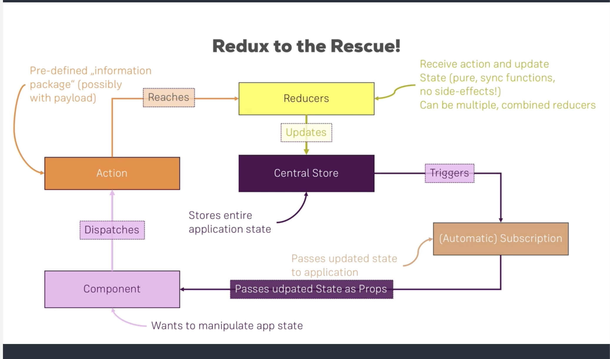

# Redux Day 2

> My forearm has started to hurt on the underside of my arm, so I am trying to limit the amount of excess typing that I will be doing.
>
> Sorry if the notes are not as dense, but I will still work on creating good markdown content!

local state - state that only pertains to that particular component

useState and useEffect - using hooks to get the information, the set up is a lot more readable and simple.

`import React, { useState } from 'react'`
`const [counter, setCounter] = useState(0)`

Example for today was with a blue and red counter, but because they are using local state, the counter for each component are separate. We need to add Redux to have them work with each other, OR have a lot of links via props and children.

## Redux Diagram

The redux diagram is super important, memorize the Redux Diagram!



## Implementing Redux

- `npm install redux`
- `npm install react-redux`
- Create Store Folder
- Add the reducer
  - reducer.js
    - create the initialState
    - `const initialState = { counter: 33333, username: 'johndoe' }`
    - create the reducer
    - `const reducer = (state = initialState, action) => { if( action.type == 'INC_COUNTER') { return { ...state, counter: state.counter } } }`
- Place Store in index.js
  - import Provider from 'react-redux'
- Add the `<Provider store = {store}>` in the ReactDOM.render
  - You can have multiple stores, but we're not diving into that complexity in class
- Make sure you add props to the functional components when you create them!
- `import { connect } from 'react-redux'`
  - connect is a function that will connect the component to the global state.
- `export default connect()(RedCounter);`
- Add in the mapStateToProps
  - `const mapStateToProps = (state) => { return ( ctr: state.counter ) }`
  - You are mapping the global state to the properties
  - Then you have to pass the first argument of the connect as mapStateToProps
  - `export default connect(mapStateToProps)(RedCounter);`
- Now you can access the global state in the properties for the component!
  - `{props.ctr}`
- Add in the mapDispatchToProps
  - `const mapDispatchToProps = (dispatch) => { return { onIncrement: () => dispatch({ type: 'INC_COUNTER' })}}
  - Link to connect
  - `export default connect(mapStateToProps, mapDispatchToProps)(RedCounter);`
  - Link to props.onIncrement() for your onButtonClick function in your component.
- Do the same for the blue counter
  - import connect
  - connect everything together
  - Add in mapStateToProps
  - Add in mapDispatchToProps
  - implement with the props and functions of the app component

## Azam's Movie App

App.js

```js
import React, { useState, useEffect } from "react";
import logo from "./logo.svg";
import "./App.css";
import MovieList from "./MovieList";

function App() {
  const [search, setSearch] = useState("");
  const [movies, setMovies] = useState([]);

  const onSearchChange = value => {
    setSearch(value);
  };

  const onSearchClick = () => {
    fetchMovies();
  };

  const fetchMovies = () => {
    const url = `http://www.omdbapi.com/?s=${search}&apikey=564727fa`;
    fetch(url)
      .then(response => response.json())
      .then(json => {
        setMovies(json.Search);
      });
  };

  return (
    <div>
      <input type="text" onChange={e => onSearchChange(e.target.value)} />
      <button onClick={() => onSearchClick()}>Search</button>
      <MovieList movies={movies} />
    </div>
  );
}

export default App;
```

MovieList.js

```js
import React from "react";

function MovieList(props) {
  return (
    <div>
      {props.movies.map(movie => {
        return <div>{movie.Title}</div>;
      })}
    </div>
  );
}

export default MovieList;
```

## Azam's Redux Day 2 Notes

index.js

```js
import React from "react";
import ReactDOM from "react-dom";
import "./index.css";
import App from "./App";
import * as serviceWorker from "./serviceWorker";
// create store is used to create a global store
import { createStore } from "redux";
// provider allows react to access the global store AKA global state
import { Provider } from "react-redux";
// import reducer so we can feed it to the store
import reducer from "./store/reducer";

// create a store
const store = createStore(
  reducer,
  window.__REDUX_DEVTOOLS_EXTENSION__ && window.__REDUX_DEVTOOLS_EXTENSION__()
);

ReactDOM.render(
  // Provider component is passing the store to the root component of the app
  <Provider store={store}>
    <App />
  </Provider>,
  document.getElementById("root")
);

// If you want your app to work offline and load faster, you can change
// unregister() to register() below. Note this comes with some pitfalls.
// Learn more about service workers: https://bit.ly/CRA-PWA
serviceWorker.unregister();
```

App.js

```js
import React, { useEffect } from "react";
import logo from "./logo.svg";
import "./App.css";
import RedCounter from "./RedCounter";
import BlueCounter from "./BlueCounter";
import MovieList from "./MovieList";
import { connect } from "react-redux";

function App(props) {
  useEffect(() => {
    fetch("http://www.omdbapi.com/?s=batman&apikey=564727fa")
      .then(response => response.json())
      .then(json => {
        console.log(json);
        props.onMoviesLoaded(json.Search);
      });
  });

  return (
    <div>
      <RedCounter />
      <BlueCounter />
      <MovieList />
    </div>
  );
}

const mapDispatchToProps = dispatch => {
  return {
    onMoviesLoaded: movies =>
      dispatch({ type: "MOVIES_LOADED", movies: movies })
  };
};

export default connect(
  null,
  mapDispatchToProps
)(App);
```

RedCounter.js

```js
import React, { useState } from "react";
import logo from "./logo.svg";
import "./App.css";
// connect allows your component to read values or
// dispatch/update values for the global state
import { connect } from "react-redux";

function RedCounter(props) {
  const [counter, setCounter] = useState(0);

  const onRedButtonClicked = () => {
    //setCounter(counter + 1)
    props.onIncrement();
  };

  return (
    <div className="red-counter">
      {props.ctr}
      <button onClick={() => onRedButtonClicked()}>Increment</button>
    </div>
  );
}

const mapStateToProps = state => {
  // state is global state
  return {
    ctr: state.counter // props.ctr in our component
  };
};

const mapDispatchToProps = dispatch => {
  return {
    onIncrement: () => dispatch({ type: "INC_COUNTER" })
  };
};

export default connect(
  mapStateToProps,
  mapDispatchToProps
)(RedCounter);
```

BlueCounter.js

```js
import React, { useState } from "react";
import logo from "./logo.svg";
import "./App.css";
import { connect } from "react-redux";

function BlueCounter(props) {
  const [counter, setCounter] = useState(0);

  const onBlueButtonClicked = () => {
    setCounter(counter + 1);
  };

  return <div className="blue-counter">{props.count}</div>;
}

const mapStateToProps = state => {
  return {
    count: state.counter // props.count
  };
};

export default connect(mapStateToProps)(BlueCounter);
```

MovieList.js

```js
import React from "react";

function MovieList(props) {
  return <div>MovieList</div>;
}

export default MovieList;
```

reducer.js

```js
const initialState = {
  counter: 99,
  username: "johndoe",
  movies: []
};

const reducer = (state = initialState, action) => {
  if (action.type == "INC_COUNTER") {
    return {
      ...state,
      counter: state.counter + 1
    };
  } else if (action.type == "MOVIES_LOADED") {
    return {
      ...state,
      movies: action.movies
    };
  }

  return state;
};

export default reducer;
```
